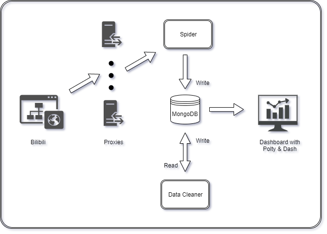

## Web-Scraper-Starter

This is a web scrap project, built on top of Python and Mongodb. 


### Existing Web Scrapers
1. [Bilibili](https://www.bilibili.com) (completed)
2. [Chemist Warehouse](https://www.chemistwarehouse.com.au) (ongoing)


### Project Structure
```text
.
├── bilibili                   # Project files for bilibili 
│   ├── helper                 # customized molude
│   ├── data_extractor         # spider for bilibili
│   ├── data_cleaner           # data cleaning on MongoDB
│   ├── video_analysis         # dashboard built on Poltly & Dash
│   └── api_call_sample.json   # bilibili danmaku api call sample
├── chemist_warehouse          # Project files for Chemist Warehouse
│   ├── data_extractor         # spider for chemist warehouse
│   └── review_sample.json     # product review api call sample
├── images                     # Images for architecture
├── proxy                      # Customized Proxy Package
├── LICENSE
├── .env-sample                # Rename to .env to setup environmental variables
├── .gitignore
├── requirements.txt
└── README.md
```


### Bilibili Scraper Architecture



### Bilibili Scraper Setup 
1.Clone the whole project
```shell script
$ git clone https://github.com/DANancy/Web-Scraper-Starter.git
```

2.Install Python Projects
```shell script
$ pip install -r requirements.txt
```

3.Install [MongoDB](https://www.mongodb.com/download-center/enterprise?tck=docs_server) & [Robo 3T](https://robomongo.org/)

4.Create .env File
```text
COOKIE: setup cookie info for website login
PASSWORD: setup user password for website login
USERNAME: setup username for website login
DBCONNECT: setup DB Connection
```

5.Setup self-defined module -> bilibili/helper.py
```python
import pandas
# get package folder
print(pandas.__file__)
# copy this module to the package folder
```

6.Setup Proxy DB
```shell script
$ python proxy\proxy_extractor.py
```

7.Run Extractor
```shell script
$ python bilibili\bilibili_data_extractor.py
```

8.Run Cleaner
```shell script
$ python bilibili\bilibili_data_cleaner.py
```

9.Run Dashboard
```shell script
$ python bilibili\video_analysis.py
```


### References
* [XPATH](https://devhints.io/xpath)
* [REGEX](https://www.debuggex.com/cheatsheet/regex/python)
* [Seleinum Extension for Chrome](https://chrome.google.com/webstore/detail/selenium-ide/mooikfkahbdckldjjndioackbalphokd?hl=en)
* [Search Engine for IoT](https://www.shodan.io/)


### Credits
* [Mutoo](https://github.com/mutoo) - Wash dishes and take care of baby while I am programming :D